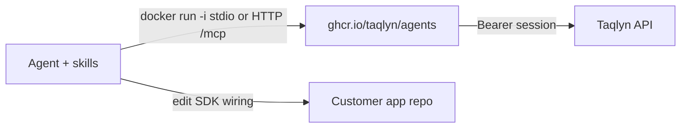

# Context

**Users:** developers integrating Taqlyn; marketers who only need links (MCP still uses the same org session).

**Clients:** Cursor / Claude / other MCP hosts (stdio subprocess or HTTP). Later: hosted MCP on the same Go binary.

**Externals:** Live Taqlyn HTTPS API only (`https://api.rutvik.qzz.io` by default). Session Bearer (`POST /v1/auth/login`). Not localhost, not Ed25519 `sk_` keys.

