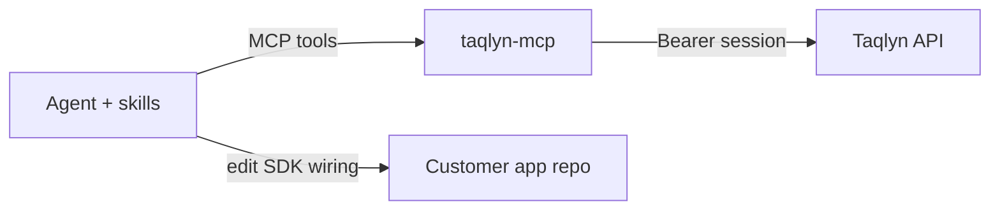

# Context

**Users:** developers integrating Taqlyn; marketers who only need links (MCP still uses the same org session).

**Clients:** Cursor / Claude / other MCP hosts (stdio subprocess or HTTP). Later: hosted MCP on the same Go binary.

**Externals:** Taqlyn control-plane HTTP API (`TAQLYN_API_URL`). Session Bearer (`POST /v1/auth/login`). Not Ed25519 `sk_` keys.

