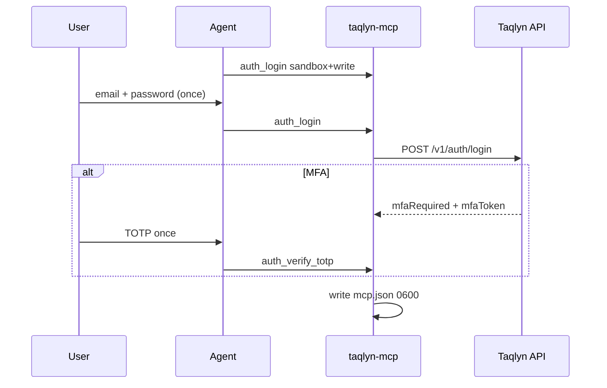
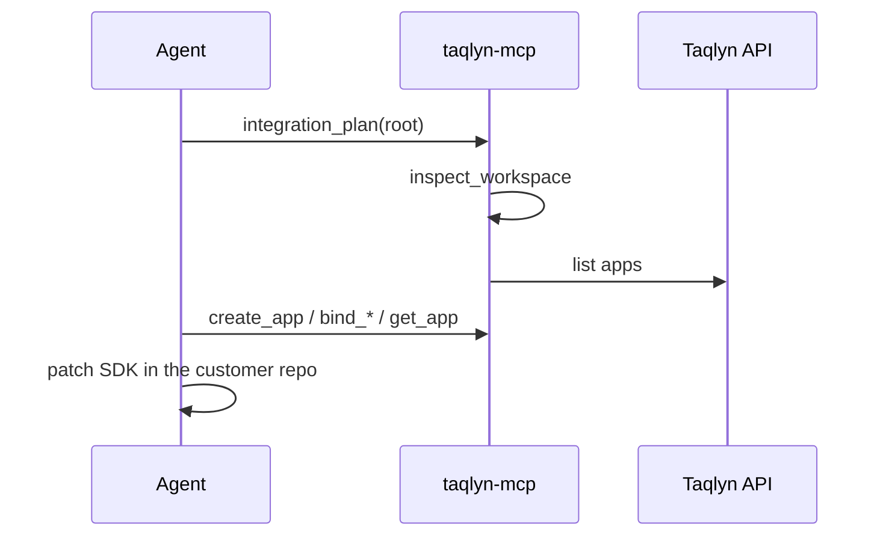

# Sequences

## Login

```mermaid
sequenceDiagram
  participant U as User
  participant A as Agent
  participant M as taqlyn-mcp
  participant API as Taqlyn API
  A->>M: auth_login sandbox+write
  U->>A: email + password (once)
  A->>M: auth_login
  M->>API: POST /v1/auth/login
  alt MFA
    API-->>M: mfaRequired + mfaToken
    U->>A: TOTP once
    A->>M: auth_verify_totp
  end
  M->>M: write mcp.json 0600
```

## Integrate

```mermaid
sequenceDiagram
  participant A as Agent
  participant M as taqlyn-mcp
  participant API as Taqlyn API
  A->>M: integration_plan(root)
  M->>M: inspect_workspace
  M->>API: list apps
  A->>M: create_app / bind_* / get_app
  A->>A: patch SDK in the customer repo
```
